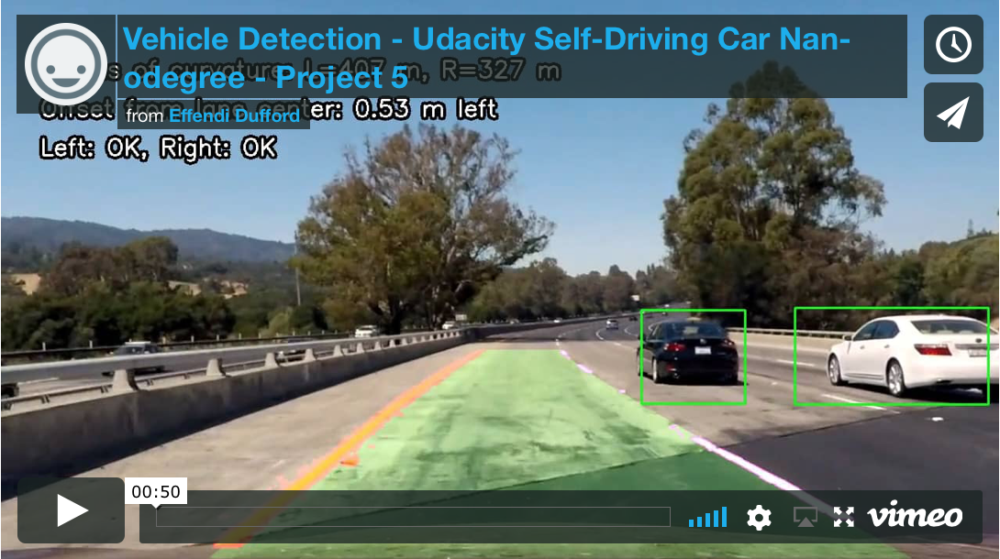

# **Vehicle Detection**

**Udacity Self Driving Car Nanodegree - Project #5**

2017/8/29

## Overview

This project detects vehicles in a camera's images of driving by using a **linear Support Vector Classifier (SVC)** trained on ~18k labeled images of cars and not cars (subsets of [GTI](http://www.gti.ssr.upm.es/data/Vehicle_database.html) and [KITTI](http://www.cvlibs.net/datasets/kitti/) data sets).  The training images are processed to extract features including **Histogram of Oriented Gradients (HOG)** and **LAB Color Space Histograms**.  For each image from the driving camera, a **sliding window search** extracts the same features from various size image patches and uses the SVC to detect if a car exists.  The combined detected windows are used to make **thresholded heat maps** that indicate the car's boundaries, and the **heat maps are combined over multiple image frames** to filter out false positive detections and draw final bounding boxes around the detected cars.

For more details about the results of this activity, see the [project writeup document](writeup_P5.md).

## Key Files

| File 										|     Description	        												|
|:-----------------------------------------:|:-------------------------------------------------------------------------:|
| P5_VehicleDetection.ipynb					| IPython notebook with all project code 									|
| [writeup_P5.md](writeup_P5.md)								| The project writeup explaining the results								|
| /output_images/project_video_final.mp4	| Output video of vehicle detection result also including lane detection	|

The original Udacity project repository is [here](https://github.com/udacity/CarND-Vehicle-Detection).

## How to Run Code

1. Set up [Udacity Self-Driving Car Term 1 Starter Kit](https://github.com/udacity/CarND-Term1-Starter-Kit) environment (Python 3, NumPy, Matplotlib, OpenCV)

2. Set up [fast-histogram](https://github.com/astrofrog/fast-histogram) Python package that provides ~10x faster performance than np.histogram().

3. Download the Udacity-provided image data sets for [vehicles](https://s3.amazonaws.com/udacity-sdc/Vehicle_Tracking/vehicles.zip) and [non-vehicles](https://s3.amazonaws.com/udacity-sdc/Vehicle_Tracking/non-vehicles.zip) and extract into the /data/vehicles/ and /data/non-vehicles/ folders.

4. Open the IPython notebook "P5_VehicleDetection.ipynb" using Jupyter, and execute all cells.
