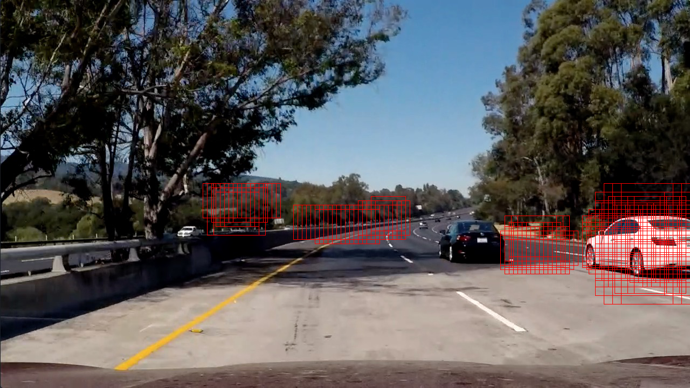
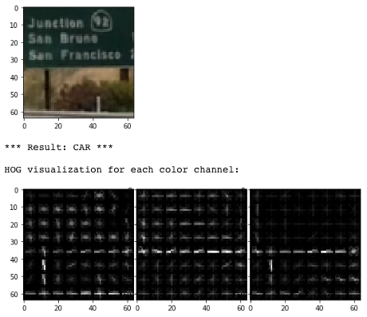

# **Vehicle Detection**

**Udacity Self Driving Car Nanodegree - Project #5**

Effendi Dufford
2017/8/29

## Project Goal

The goals / steps of this project are the following:

* Perform a Histogram of Oriented Gradients (HOG) feature extraction on a labeled training set of images and train a Linear Support Vector Machine Classifier (SVC)
* Optionally, you can also apply a color transform and append binned color features, as well as histograms of color, to your HOG feature vector. 
* Note: for those first two steps don't forget to normalize your features and randomize a selection for training and testing.
* Implement a sliding-window technique and use your trained classifier to search for vehicles in images.
* Run your pipeline on a video stream (start with the test_video.mp4 and later implement on full project_video.mp4) and create a heat map of recurring detections frame by frame to reject outliers and follow detected vehicles.
* Estimate a bounding box for vehicles detected.

## Results by Rubric Criteria

### Writeup / README

#### 1. Provide a Writeup / README that includes all the rubric points and how you addressed each one.

My project files are located in this [github repository](https://github.com/edufford/CarND-Vehicle-Detection-P5).
The key contents are:

| File 										|     Description	        													| 
|:-----------------------------------------:|:-----------------------------------------------------------------------------:| 
| P5_VehicleDetection.ipynb					| IPython notebook with all project code 										| 
| writeup_P5.md								| This project writeup															|
| /output_images/project_video_final.mp4	| Output video of vehicle detection result with lane finding from Project #4	|

### Histogram of Oriented Gradients (HOG)

#### 1. Explain how (and identify where in your code) you extracted HOG features from the training images.  Explain how you settled on your final choice of HOG parameters.

*(IPython code cells 2, 5-8)*

To extract HOG features, I used the skimage **hog()** function on **all color channels** with parameters chosen by a **parameter study described below**.  I decided to also append **color histogram features** because HOG gradients are mainly dependent on the image shapes, so additional color information should help improve car detection.

I **did not use spatial features** because keeping the spatial size large enough to maintain the car's details becomes similar to template matching where the features may not generalize well, and pooling the pixels down to a smaller spatial size for generality may lose the car's details and create more false positives.

To do the **parameter study for selecting color space, color histogram bins, HOG orientation bins, HOG pixels/cell, and HOG cells/block**, I chose one test image and ran the Support Vector Classifier (SVC) car detection over a full grid of sliding windows.  The resulting images with detected windows were evaluated subjectively to see how well the actual cars in the image were identified without too many false positives.  The SVC's accuracy on the test data set and the time to analyze a single frame were also compared to help select the best parameters.

*Note: All parameter sets tested using "test5.jpg" image and a full grid of sliding windows at 1.0x, 1.5x, and 2.0x scales*

---

##### Color Space Parameter Study

First, with only color space histogram features enabled, I set 256 histogram bins (no pooling) and evaluated various color spaces (RGB, HSV, YCrCb, and LAB).  Both YCrCB and LAB could identify the white car but with some patches of false positives.  LAB detection seemed to fit around the white car better than YCrCb so **I selected LAB color space**.

| Test Case	| Color Space	| Histogram Bins	| HOG Orientation Bins	| HOG Pix Per Cell	| HOG Cell Per Block	| 
|:---------:|:-------------:|:-----------------:|:---------------------:|:-----------------:|:---------------------:|
| 1			| RGB			| 256				| Disabled				| Disabled			| Disabled				|
| 2			| HSV			| 256				| Disabled				| Disabled			| Disabled				|
| 3			| YCrCb			| 256				| Disabled				| Disabled			| Disabled				|
| 4			| **LAB**		| 256				| Disabled				| Disabled			| Disabled				|

**Test Results:**

| Test Case	| Feature Length	| Test Accuracy	| Car Detection	| False Positives	| sec/frame	|
|:---------:|:-----------------:|:-------------:|:-------------:|:-----------------:|:---------:|
| 1			| 768				| 95.5%			| Poor			| Poor				| 1.42 		|
| 2			| 768				| 98.6%			| Poor			| Poor				| 1.54 		|
| 3			| 768				| 97.1%			| Marginal		| Marginal			| 1.45 		|
| 4			| 768				| **97.8%**		| **Marginal**	| **Marginal**		| 1.48 		|

 Test #1: RGB

 Test #2: HSV

 Test #3: YCrCb

 Test #4: **LAB <- selected**

---

##### Color Histogram Bin Parameter Study

After selecting LAB color space, I tested decreasing the number of color histogram bins to see if pooling the bins could better generalize the detection.  With 128 and 64 bins, the black car started to become detected but at 32 and 16 bins it was lost again. 64 bins also had fewer false positives than 128 bins, so **I selected 64 histogram bins**.

| Test Case	| Color Space	| Histogram Bins	| HOG Orientation Bins	| HOG Pix Per Cell	| HOG Cell Per Block	| 
|:---------:|:-------------:|:-----------------:|:---------------------:|:-----------------:|:---------------------:|
| 5			| LAB			| 128				| Disabled				| Disabled			| Disabled				|
| 6			| LAB			| **64**			| Disabled				| Disabled			| Disabled				|
| 7			| LAB			| 32				| Disabled				| Disabled			| Disabled				|
| 8			| LAB			| 16				| Disabled				| Disabled			| Disabled				|

**Test Results:**

| Test Case	| Feature Length	| Test Accuracy	| Car Detection	| False Positives	| sec/frame	|
|:---------:|:-----------------:|:-------------:|:-------------:|:-----------------:|:---------:|
| 5			| 384				| 97.7%			| Good			| Marginal			| 1.44 		|
| 6			| 192				| **97.1%**		| **Good**		| **Good**			| 1.40 		|
| 7			| 96				| 96.8%			| Marginal		| Good				| 1.39 		|
| 8			| 48				| 95.0%			| Marginal		| Good				| 1.41 		|

 Test #5: 128 histogram bins

 Test #6: **64 histogram bins <- selected**

 Test #7: 32 histogram bins

 Test #8: 16 histogram bins

---

##### HOG Parameter Study (LAB color space, HOG on all channels)

I next disabled the color histogram features and enabled only HOG features.  I kept the dimension of **8 pixels/cell** for all tests because it is a good amount to divide up the 64x64 pixel training images evenly into 8x8 cells.  For the number of orientation bins, increasing from 8 to 16 and 32 strengthened the detection with more detected windows on each car but at the expense of higher feature size and longer sec/frame processing time.  With 32 orientation bins, increasing the normalization cells/block increased feature size even more and almost doubled the processing time without any added benefit to the detection result, so **I selected 32 orientation bins and 2 cells/block**.

| Test Case	| Color Space	| Histogram Bins	| HOG Orientation Bins	| HOG Pix Per Cell	| HOG Cell Per Block	| 
|:---------:|:-------------:|:-----------------:|:---------------------:|:-----------------:|:---------------------:|
| 9			| Disabled		| Disabled			| 8						| 8					| 2						|
| 10		| Disabled		| Disabled			| 16					| 8					| 2						|
| 11		| Disabled		| Disabled			| **32**				| **8**				| **2**					|
| 12		| Disabled		| Disabled			| 32					| 8					| 4						|

**Test Results:**

| Test Case	| Feature Length	| Test Accuracy	| Car Detection	| False Positives	| sec/frame	|
|:---------:|:-----------------:|:-------------:|:-------------:|:-----------------:|:---------:|
| 9			| 4704				| 98.9%			| Good			| Good				| 1.92 		|
| 10		| 9408				| 99.4%			| Good			| Good				| 2.09 		|
| 11		| 18816				| **99.6%**		| **Good**		| **Good**			| **2.56**	|
| 12		| 38400				| 99.4%			| Good			| Good				| 4.07 		|

 HOG with 8 orientation bins

 HOG with 16 orientation bins

 **HOG with 32 orientation bins <- selected**

 HOG with 32 orientation bins, 4 cells/block

---

##### Combined Color Histogram + HOG Parameter Result

Finally, I tested the **final combined color histogram + HOG parameter set** selected from the test results described above.  Both the black and white cars had **good detection** with many overlapping frames on each car and had **minimal false positives**.  The SVC accuracy on the test data set was 99.7%.

| Test Case	| Color Space	| Histogram Bins	| HOG Orientation Bins	| HOG Pix Per Cell	| HOG Cell Per Block	| 
|:---------:|:-------------:|:-----------------:|:---------------------:|:-----------------:|:---------------------:|
| Final		| **LAB**		| **64**			| **32**				| **8**				| **2**					|

**Test Result:**

| Test Case	| Feature Length	| Test Accuracy	| Car Detection	| False Positives	| sec/frame	|
|:---------:|:-----------------:|:-------------:|:-------------:|:-----------------:|:---------:|
| Final		| **19008**			| **99.7%**		| **Good**		| **Good**			| **3.29**	|

 **Final selected parameters**

---

#### 2. Describe how (and identify where in your code) you trained a classifier using your selected HOG features (and color features if you used them).

*(IPython code cell 8, 9, 13, 14)*

After selecting the feature parameters, I extracted the features from the provided GTI and KITTI car/not car library images and trained a **linear Support Vector Classifier (SVC)** using **GridSearchCV()** to select the parameter **C** with the best accuracy on the test data set.  I did not use other SVC kernels such as "rbf" for this project because the processing time became much slower and the linear kernel already gave good prediction accuracy.

For feature extraction, I found that implementing **parallel processing** using Python's **pool.map()** function for 8 CPU cores had a huge performance advantage, reducing the total feature extraction time for ~18k images from ~6 min to ~30 sec.

The GTI car library images contains some **time-series data** resulting in multiple car images that are very similar to each other.  If these images are randomly split into training and test data sets, the SVC test accuracy may be artificially high because of having almost identical images in both sets.  To avoid this, I split the test data set manually to **only include KITTI car images for the test set**.

The data sets are normalized to zero mean and unit variance by using a **StandardScaler()** transform function.

I ran the parameter grid search for C values of 1.0, 0.001, and 0.00001 and the best result was with **C=0.001**, shown in the table below.  The test accuracy differences were very small, so it seems that **C did not have a big effect for the linear kernel**.  Training times were also very short and the test accuracy seems higher than expected, so the real test is to see how the SVC can perform on actual driving images with a sliding window search.

**Linear SVC Grid Search Results:**

| Parameter C	| Test Accuracy	| Training Time	|
|:-------------:|:-------------:|:-------------:|
| 1.0			| 99.146%		| ~8 sec		| 
| **0.001**		| **99.152%**	| ~18 sec		| 
| 0.00001		| 98.939%		| ~7 sec		| 

After training the SVC, I visualized some classification results to see the HOG features for cars vs not cars.  In this example, the car's shape seems mainly identified by the trapezoidal rear window.

 

---

### Sliding Window Search

#### 1. Describe how (and identify where in your code) you implemented a sliding window search.  How did you decide what scales to search and how much to overlap windows?

*(IPython code cell 10)*

I implemented a sliding window search with **multiple scales of the SVC's base 64x64 image window**.  I selected scales of 1.5x, 1.0x, 0.9x, and 0.7x based on testing various images from the project video to get enough overlapping detection windows on the cars at various distances down the road.

The y start/stop dimenstions are selected to **limit the search to the region where cars of that size are expected** to be considering the vanishing size down the road.

For step sizes, I implemented a **step skipping algorithm to focus the smallest steps near previously detected car windows**.  Outside of detected windows, the sliding skips steps to reduce the total number of windows searched and improve the processing time.

| Scale	| cells/step near detected windows	| steps/skip outside of detected windows	| ystart, ystop	|
|:-----:|:---------------------------------:|:-----------------------------------------:|:-------------:|
| 1.5x	| 1									| 2											| 340, 628		|
| 1.0x	| 1									| 2											| 340, 532		|
| 0.9x	| 1									| 2											| 390, 480		|
| 0.7x	| 1									| 2											| 390, 480		|

For each of the four sliding window parameter sets, the following **processing steps** are used to search for cars:

1. Slice image by y start/stop limits
2. Rescale image
3. Convert color space
4. Calculate sliding window steps including skips in areas outside of previously detected car windows
5. Make HOG features for entire scaled image slice
6. Slide window by steps and for each window's image patch, subsample HOG features, extract color histogram features, combine features and normalize with scaler
7. Use SVC classifier on each window's image patch features to detect CAR or NOT CAR
8. Store and return list of hot windows where cars were detected

Each sliding window parameter set is processed in parallel using **pool.map()** over the list of total window sets to **split up the processing over multiple CPU cores** for faster performance.

The following images show an **example of the sliding window searches** with smaller steps near the red previous detection windows.  The first two search windows are shown in cyan and magenta to show the initial step size.

**Sliding window search at 1.5x scale:**

**Sliding window search at 1.0x scale:**

**Sliding window search at 0.9x scale:**

**Sliding window search at 0.7x scale:**

---

#### 2. Show some examples of test images to demonstrate how your pipeline is working.  How did you optimize the performance of your classifier?

*(IPython code cell 18)*

My **overall vehicle detection pipeline** has the following steps:

1. Use sliding window search with pooled subsampling to find initial raw detection windows
2. Make base heatmap and apply initial threshold filter
3. Combine heatmaps over multiple frames and apply another threshold filter
4. Label cars from the combined heatmap
5. Draw final bounding boxes around car labels and overlay on original road image

The reliability of the classifier was improved by applying the heatmap thresholds and combining heatmaps over multiple frames to eliminate some of the weaker false positive detections.

Example images of these steps are shown below:

**Step 1: Initial raw detection windows from sliding window search:**

**Heatmap processing:**

**Step 2** (Top Right): Base heatmap with threshold, **Step 3** (Bottom Right): Combined heatmap with threshold, **Step 4** (Bottom Left): Labeled cars from combined heatmap, **Step 5** (Top Left): Final bounding boxes

**Final output image with detected bounding boxes**

This pipeline had good results on the test images, but when running it on the project video there were still some strong **false positives** found.  To eliminate these false positives, I did **hard negative mining** to extract the false positive detected image patches and include them in the "not car" image library to retrain the SVC.

**Example of False Positives (Road Sign):**

 

After retraining the SVC including the hard negatives, the **false positives were reduced** in the project video as expected, but **further testing on new videos should be done** to see if this was generalized to other objects like similar road signs.

**After retraining SVC with hard negatives:**

---

### Video Implementation

#### 1. Provide a link to your final video output.  Your pipeline should perform reasonably well on the entire project video (somewhat wobbly or unstable bounding boxes are ok as long as you are identifying the vehicles most of the time with minimal false positives.)

Here's a [link to my project video final result](./output_images/project_video_final.mp4), which also includes lane detection from my previous [Project #4](https://github.com/edufford/CarND-Advanced-Lane-Lines-P4).

#### 2. Describe how (and identify where in your code) you implemented some kind of filter for false positives and some method for combining overlapping bounding boxes.

*(IPython code cell 11)*

Some filtering of false positives is done by the **heatmap thresholds** and **combining heatmaps over multiple frames** by sum.  The heat map processing has the following steps:

1. Make base heatmap with +1 increment in all raw detection windows
2. Threshold heatmap to zero out any areas < 2 to filter out false positive noise
3. Combine heatmaps over last 40 frames by sum (instead of average to get higher heat counts for ease of setting final threshold)
4. Threshold combined heatmap to zero out any areas < 60 to filter out weak false positives and trim detected area to stay closer to body of cars
5. Apply 16x16 blur filter to smooth edges of combined heatmap
6. Use label() function on blurred combined heatmap to identify each car
7. Draw bounding boxes around x and y min/max values for each car label

This filtering was enough to **get rid of weak false positives and single detection window noise**.  However, some strong false positive detections could still get through the threshold filters, especially if they were near the cars in the image so additional hard negative image mining was done as described in the previous sections above.

---

### Discussion

#### 1. Briefly discuss any problems / issues you faced in your implementation of this project.  Where will your pipeline likely fail?  What could you do to make it more robust?

The main challenge with this project was in **implementing a good efficient sliding window search algorithm** because the **SVC detection is very brittle** and has very different results depending on slight shifts in the search window image patches.  To increase the strength of the SVC's detection, many sliding windows of different scales and small steps can be used, but this increases the processing time significantly and is inefficient.

To improve the efficiency, I spent a lot of time optimizing the processing speed such as by using a **sliding window step skipping algorithm**, **parallel processing** with the pool.map() function, and importing a **faster histogram module** ([fast-histogram](https://github.com/astrofrog/fast-histogram)) that is ~10x faster than np.histogram, but each frame still takes ~1.5 sec to process so it would not work in real-time.

Another challenge was the **SVC's many false positives**.  Using a linear SVC does not have many hyperparameters to tune and the C parameter didn't seem to have much effect.  The false positives could be reduced by heatmap filtering and hard negative mining, but false positives are still likely to occur if this pipeline was used on other real world driving images.

To make this more robust, other detection algorithms such as CNNs, [YOLO](https://arxiv.org/abs/1506.02640), or [SSD](https://arxiv.org/abs/1512.02325) would probably have better accuracy but are much more difficult to train and implement than a simple linear SVC.